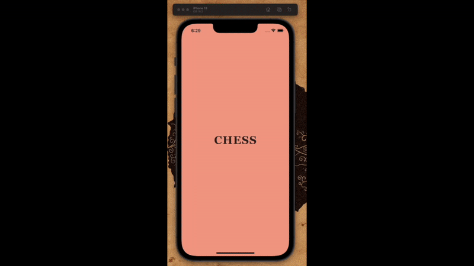

# Flutter Chess

I am developing a game of Chess in Flutter. Using no packages, libraries or plugins I am coding everything from scratch, which includes game logic, game board, NegaMax algorithm-based AI (pending) and online multiplayer (pending).

Visit: https://1998apoorvmalik.github.io/flutter-chess/ to play the alpha version.
